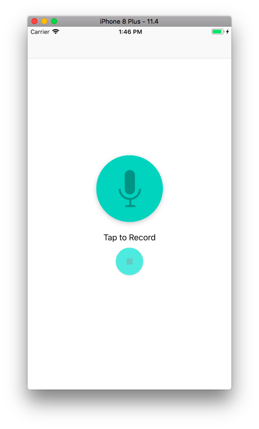
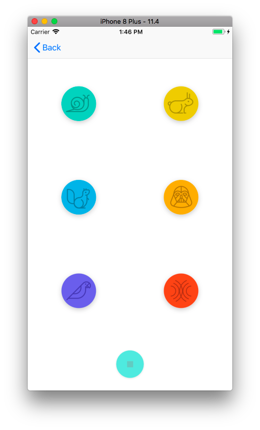

# Voice Changer

I will make an iPhone app that will allow users to record their voice and will then modulate the recorded audio to sound like a Chipmunk or Darth Vader. This app will also let the user speed up or slow down the rate of playback, and experience fun echo and reverb effects.

Why this project?
The first step in becoming an iOS Developer is to create my first app! **Voice Changer** provides a substantial, while not overly complicated, introduction to the iOS ecosystem.

I will learn how to:

- Create a new project from existing iOS app templates
- Add buttons, images, labels and create user interfaces for the app using the Storyboard
- Leverage the Model View Controller (MVC) design principles; this includes writing custom model code, and using UIViewController, and UIView
- Create Outlet and Action connections between the views and view controllers. Benefit from the power of Delegates by using them in code
- Navigate between two scenes in the app using UINavigationController
- Play audio files using AVFoundation’s AVAudioEngine class
- Run the iOS simulator and download the app on a physical device
- Search documentation, resolve bugs, and read other people’s code

## Record Sounds View Controller
This is the first view shown when the user launches the app.  The user presses the record button, records the sound they will later apply effects to, then presses the stop button to finalize the recording. Successfully recording a clip segues the app to the playSoundsViewController.

## Play Sounds View Controller
This is the view controller presented when the user successfully records a sound.  Each button plays the recorded sound with a different effect on them.  Pressing the stop button will stop the current sound from finishing playing.

